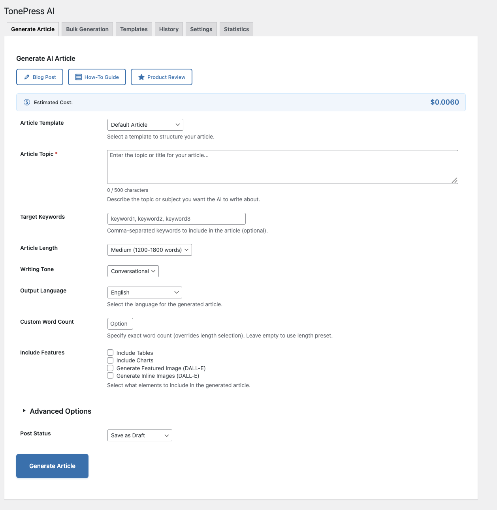
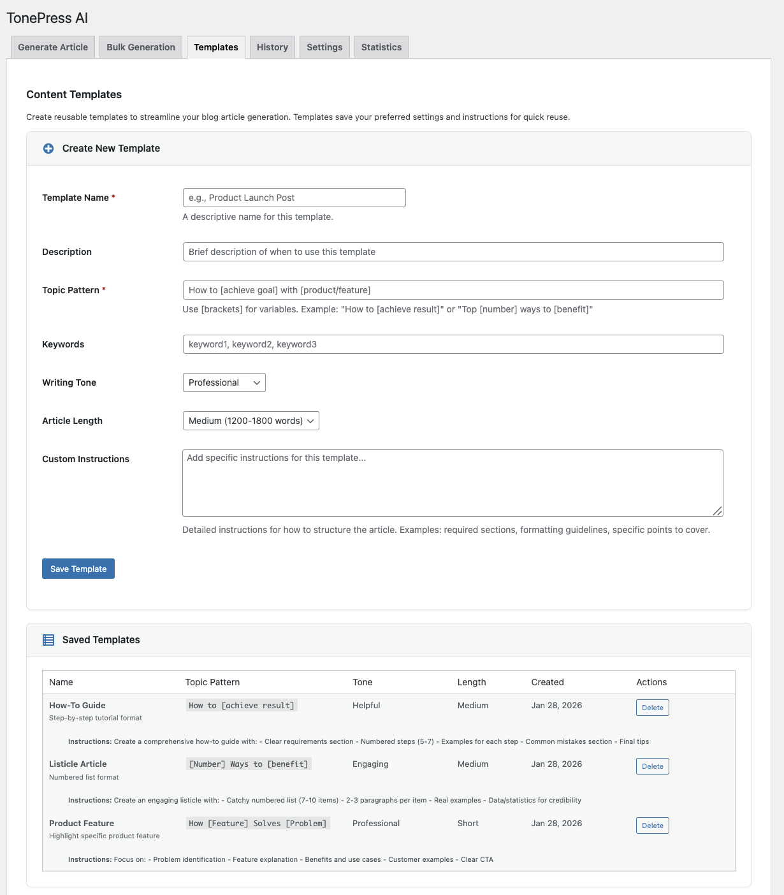
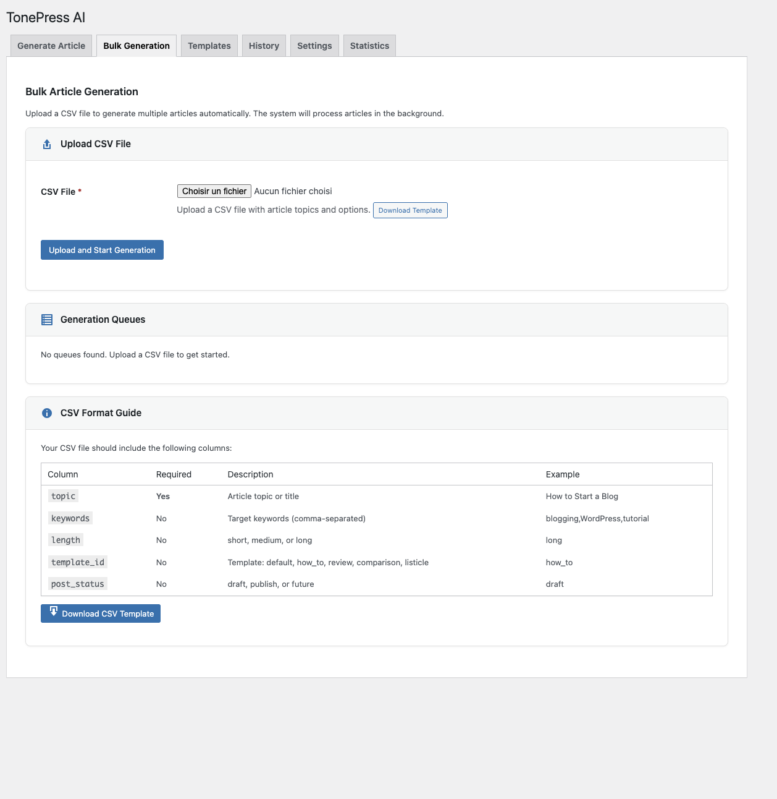
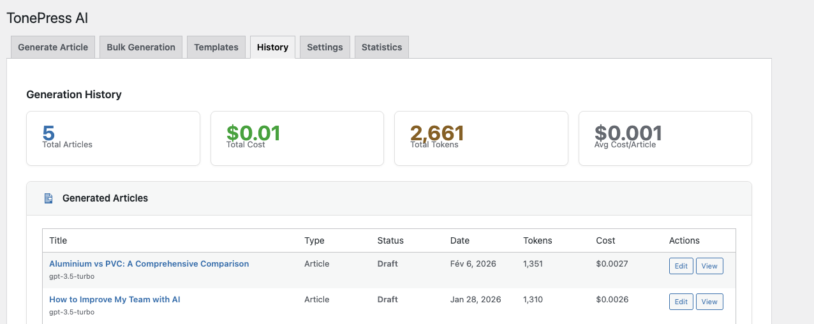

# TonePress AI — WordPress Blog Generator with Custom Tones & SEO Optimization


  

## 📸 Screenshots

| **1. Modern Dashboard** | **3. Template Selection** |
|:---:|:---:|
|  |  |
| **2. Bulk Generation** | **4. History & Archives** |
|  |  |

---

## 🇬🇧 English Description

**TonePress AI** is the ultimate **AI content generator for WordPress**, designed to automate your blog post creation while maintaining high quality. Leveraging OpenAI's GPT models, it delivers **blog post automation** that feels human, ranking high on Google thanks to built-in SEO optimization.

Start creating **SEO-optimized blog articles** that engage your audience and drive traffic, all within your WordPress dashboard.

### 🚀 Why Use TonePress AI?
Bloggers, agencies, and directory curators choose TonePress AI because:
*   **🎨 Custom Tones:** Choose from professional, friendly, conversational, or academic styles to match your brand voice.
*   **📐 Smart Templates:** Use built-in templates like "How-to Guide", "Listicle", or "Product Review" for structured content.
*   **🔍 Automatic SEO:** Built-in integration with Yoast SEO and RankMath ensures your content is ready to rank.
*   **📊 Rich Media:** Automatically creates and embeds interactive Chart.js visualizations and comparative data tables.
*   **💰 Cost Control:** Monitor your token usage and costs directly from the dashboard.

### 🏆 Trusted by Content Creators
> "We increased blog traffic 30% using TonePress AI. The custom tones make it impossible to tell it's AI-generated!"
> — *Marketing Director, FinTech Startup*

### 🔗 Credits & Netlinking
This tool is proudly developed and maintained by **[AnouarLab](https://anouarlab.fr)**.
Looking for expert advice? Visit our **[Consulting Page](https://anouarlab.fr)** for top-tier SEO & CRO strategies.

---

## 🇫🇷 Description en Français

**TonePress AI** est un plugin WordPress professionnel conçu pour révolutionner votre création de contenu. Utilisant la puissance des modèles GPT d'OpenAI, il génère des articles de blog aux tonalités personnalisées, parfaitement optimisés pour le référencement (SEO).

**Fonctionnalités Clés :**
*   **Rédaction IA Avancée :** Créez des articles longs (800-2500+ mots) adaptés à votre ligne éditoriale (ton professionnel, amical, académique...).
*   **Modèles Intelligents :** Utilisez des templates comme "Tutoriel", "Top 10", ou "Test Produit" pour structurer vos articles.
*   **Contenu Riche & Interactif :** Intégration automatique de tableaux de données et de graphiques interactifs pour captiver vos lecteurs.
*   **SEO Ready :** Compatible nativement avec Yoast SEO et RankMath pour un référencement maximal.
*   **Maîtrise des Coûts :** Suivi précis de la consommation de tokens et outils de limitation de budget.

### 🔗 Crédits & Netlinking
Cet outil est propulsé par l'expertise de **[AnouarLab](https://anouarlab.fr)**.
Besoin de booster votre visibilité ? Visitez notre **[Page de Conseil](https://anouarlab.fr)** pour des stratégies SEO & CRO sur mesure.

---

## 🚀 Technical Documentation

### Requirements
- **WordPress**: 5.8 or higher
- **PHP**: 7.4 or higher
- **OpenAI API Key**: Required

### Installation
1. **Upload**: Upload the `tonepress-ai` folder to `/wp-content/plugins/`.
2. **Activate**: Go to Plugins → Activate "TonePress AI".
3. **Configure**: Settings → TonePress AI → Enter OpenAI API Key.

### Features Detail

#### 🤖 AI-Powered Content Generation
- Multiple writing tones (professional, conversational, authoritative, friendly, academic)
- Configurable article length (short, medium, long)
- Target keyword integration without stuffing
- Proper HTML structure with semantic headings (H1-H4)

#### 📊 Rich Content Elements
- **Data Tables**: Automatically generated comparative tables
- **Interactive Charts**: Chart.js visualizations (bar, line, pie, doughnut)

#### 🔍 SEO Integration
- **Yoast SEO** - Full integration with meta fields
- **RankMath** - Native support
- **Fallback Meta Tags** - Automatic meta injection

#### 🛡️ Security & Performance
- **API Key Encryption**: OpenSSL AES-256-CBC
- **Rate Limiting**: Configurable hourly limits
- **Caching**: Transient-based caching (24-hour default)

### Architecture
```
ACE\
├── Admin_UI           - Settings page
├── Article_Generator  - Content orchestration
├── OpenAI_Client      - API communication
└── ...
```

### JSON Response Schema
The core generator enforces a strict JSON schema for reliable output parsing:
```json
{
  "title": "Article Title",
  "content_html": "<h2>Section</h2><p>Content...</p>",
  "tables": [...],
  "charts": [...]
}
```

## Credits
- Built with [WordPress](https://wordpress.org/)
- Powered by [OpenAI](https://openai.com/)
- Charts by [Chart.js](https://chartjs.org/)
- **[AnouarLab](https://anouarlab.fr)** - SEO & CRO Testing

**Version**: 2.1.2
**Author**: AnouarLab

---

## 🧠 Ready to Scale Your Content?
**[Learn more & test TonePress AI at AnouarLab.fr](https://anouarlab.fr)**
